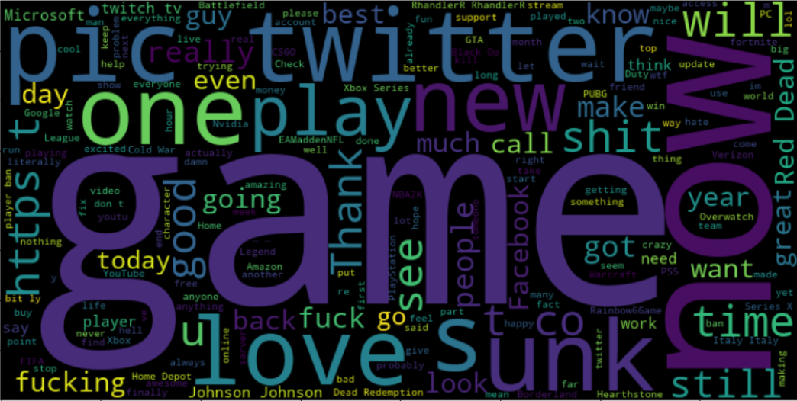

# PRODIGY_DS_04

  
Welcome to my submission for Task 4 of the data science internship at Prodigy Infotech. In this task, I conducted a sentiment analysis on Twitter data.  

## Introduction
Social media platforms like Twitter are rich sources of user opinions and sentiments. Analyzing these sentiments can provide valuable insights for businesses, researchers, and individuals. This project aims to analyze the sentiment of tweets.  

## Dataset
The dataset used for this project contains tweets labeled with their sentiment (positive, negative, neutral or irrelevant). The dataset can be found in the repository. 

## Tools and Libraries
For this project, I used the following tools and libraries:

-**Python**: For data manipulation and analysis.  
-**Pandas**: For data cleaning and preprocessing.  
-**NumPy**: For numerical operations.  
-**Scikit-learn**: For building machine learning models.  
-**Matplotlib and Seaborn**: For data visualization.  
-**Jupyter Notebook**: For documenting the analysis and visualizations.  

## Contact
For any queries or further discussion, feel free to reach out to me via LinkedIn or email.

**LinkedIn**: https://www.linkedin.com/in/kaushik-das-303126236/  
**Email**: dask72544@gmail.com  
